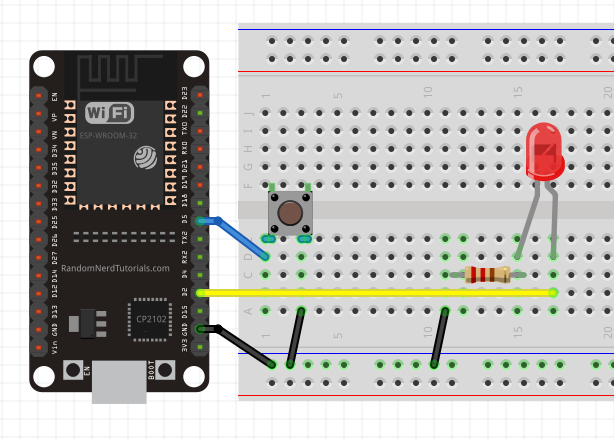

# ESP32 Button Controlled LED

ESP32 "Hello World!".

Control an LED's on/off state with a button, driven by an ESP32.

Press the button once to turn the LED on. Press again to turn the LED off.

## Fritzing Circuit Diagram

